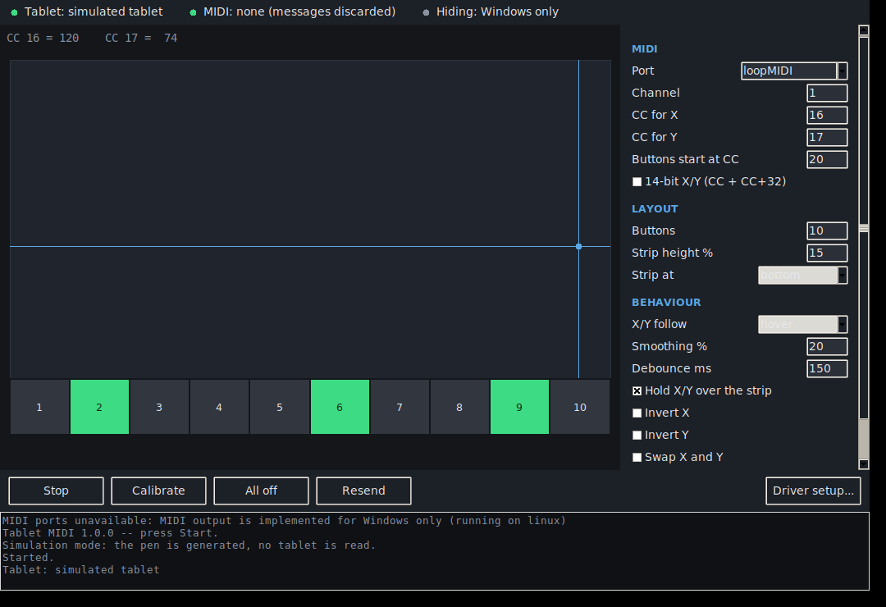

# Tablet MIDI

Transforme une tablette graphique (Medion ou autre) en contrôleur MIDI virtuel
sous Windows.

* La **position du stylet** pilote deux contrôleurs continus : X et Y.
* Une **bande de 10 boutons** en bas de la zone active, répartis sur X. Poser
  la pointe du stylet dans une case **bascule** son contrôleur (toggle).
* **La souris ne bouge plus.** La tablette est masquée à Windows : le curseur
  ne peut pas bouger, parce que Windows ne reçoit plus rien du tout.



## Les deux choses à installer d'abord

Windows impose ces deux briques ; elles ne sont pas un choix de confort.

| Logiciel | Pourquoi | Où |
|---|---|---|
| **loopMIDI** | Windows ne sait pas créer un port MIDI virtuel depuis une application. loopMIDI crée le port que ton DAW verra en entrée ; Tablet MIDI écrit dedans. | <https://www.tobias-erichsen.de/software/loopmidi.html> |
| **HidHide** | C'est lui qui masque la tablette à Windows et autorise Tablet MIDI à la lire. Sans lui, le stylet continue de déplacer le curseur. | <https://github.com/nefarius/HidHide/releases> |

## Mise en route

1. Installer **loopMIDI**, cliquer sur `+` pour créer un port (son nom par
   défaut, `loopMIDI Port`, convient).
2. Installer **HidHide**, puis redémarrer.
3. Lancer `TabletMidi.exe`.
4. Bouton **Driver setup…** → sélectionner la tablette → **Preview** pour voir
   les commandes, puis **Hide tablet**. Windows demande les droits
   administrateur : c'est normal, c'est la seule étape qui en a besoin.
5. **Débrancher et rebrancher la tablette.** Le curseur ne doit plus bouger.
6. Revenir sur la fenêtre principale, choisir le port loopMIDI, **Start**.
7. Dans le DAW, choisir `loopMIDI Port` comme entrée MIDI et apprendre les
   contrôleurs (MIDI learn).

`Driver setup… → Remove` annule tout et rend la tablette à Windows.

## Ce qui est envoyé par défaut

Canal MIDI 1.

| Geste | Message |
|---|---|
| Stylet sur X | CC **16**, 0 → 127 de gauche à droite |
| Stylet sur Y | CC **17**, 0 → 127 de haut en bas de la zone pad |
| Case 1 à 10 de la bande | CC **20** à **29**, 127 = allumé, 0 = éteint |

Tout est modifiable dans le panneau de droite. Au démarrage, l'état des dix
boutons est réémis pour que le DAW soit d'accord avec l'affichage.

## La fenêtre

* Le rectangle sombre est la zone active ; la croix suit le stylet, et passe
  au vert quand la pointe touche.
* La bande du bas montre les dix cases. Une case allumée est verte. **Cliquer
  une case à la souris la bascule aussi** — pratique pour tester le DAW.
* **Calibrate** : appuyer, passer le stylet sur toute la zone que tu veux
  réellement utiliser (coin à coin), puis **Finish**. Utile pour n'utiliser
  qu'une partie de la tablette, ou pour compenser une zone active plus grande
  que la surface dessinable.
* **All off** éteint les dix boutons, **Resend** renvoie leur état.
* **Apply** applique les réglages, **Save** les écrit dans
  `%APPDATA%\TabletMidi\config.json`.

## Réglages

| Réglage | Effet |
|---|---|
| `X/Y follow` | `hover` : X et Y suivent le stylet dès qu'il survole. `tip` : seulement pointe posée. |
| `Hold X/Y over the strip` | Gèle X et Y quand le stylet passe sur la bande de boutons, pour qu'appuyer sur un bouton ne jette pas les deux contrôleurs. Activé par défaut. |
| `Strip height %` | Hauteur de la bande, en % de la zone active. 15 % par défaut. |
| `Strip at` | `bottom` ou `top`, si tu retournes la tablette. |
| `Smoothing %` | Lissage de la position. 0 = brut, 20 % par défaut. |
| `Debounce ms` | Ignore un second appui trop rapproché dans la même case. |
| `14-bit X/Y` | Envoie X et Y en 14 bits (CC n = poids fort, CC n+32 = poids faible). À n'activer que si le DAW le gère. |
| `Invert X / Y`, `Swap X and Y` | Orientation, si la tablette est tournée. |

## En ligne de commande

L'exécutable répond aussi aux sous-commandes, depuis `cmd` ou PowerShell :

```
TabletMidi.exe doctor        vérifie tout ce qui doit être vrai, point par point
TabletMidi.exe devices       liste les tablettes vues par Windows
TabletMidi.exe ports         liste les ports MIDI de sortie
TabletMidi.exe monitor       affichage live, n'envoie rien
TabletMidi.exe run           tourne sans fenêtre
TabletMidi.exe calibrate     enregistre la zone à utiliser
TabletMidi.exe hidhide status|install|remove [--yes]
TabletMidi.exe --simulate gui   stylet simulé, pour tester le DAW sans tablette
```

`doctor` est le point de départ quand quelque chose ne marche pas : il dit
laquelle des trois conditions (port MIDI, tablette lisible, masquage actif)
n'est pas remplie.

## Si ça ne marche pas

**Le curseur bouge encore.** Le masquage n'est pas actif. `TabletMidi.exe
hidhide status` doit montrer `cloaking: True` et lister la tablette. Une
tablette expose plusieurs collections HID : `Driver setup…` les masque toutes
d'un coup. Il faut débrancher/rebrancher après.

**« Windows refused read access ».** Windows garde pour lui les collections
souris et clavier. C'est exactement ce que HidHide débloque — masquer la
tablette et autoriser `TabletMidi.exe`, puis rebrancher.

**Aucune tablette trouvée.** `TabletMidi.exe devices --all` liste toutes les
collections HID avec leur score. Si la tablette y est mais sans `X 0-… Y 0-…`,
c'est que la bonne collection n'est pas détectée ; note son chemin et mets-le
dans `device.path` du fichier de configuration.

**Résolution grossière (la souris saute par gros pas).** Les tablettes Medion
sont en général du matériel UC-Logic, qui démarre en mode « compatible souris »
et n'envoie sa pleine résolution qu'après qu'un pilote ait lu deux descripteurs
de chaîne particuliers. Tablet MIDI envoie ce réveil automatiquement à
l'ouverture. Si la résolution reste faible, désinstaller le pilote Medion
d'origine aide : il n'est plus utile une fois la tablette masquée.

**Les boutons ne basculent pas.** Il faut un contact franc de la pointe. Si
`devices` ne montre ni `tip` ni `pressure` pour ta tablette, le contact ne peut
pas être détecté sur cette collection.

**Le DAW ne voit rien.** Vérifier que le port choisi est bien un port loopMIDI
et pas une sortie matérielle : `ports` marque les ports qui ressemblent à du
loopback.

## Construire l'exécutable

L'exécutable est produit automatiquement : le workflow GitHub Actions
`Tablet MIDI` le compile sur un runner Windows et l'attache au run sous le nom
**TabletMidi-exe**, téléchargeable depuis l'onglet Actions.

Pour le compiler soi-même, sur Windows, avec un Python de python.org (qui
inclut tkinter) :

```
python build_exe.py
```

Le résultat est `dist\TabletMidi.exe`, autonome : rien à installer sur la
machine cible.

Sans compiler, depuis les sources :

```
python -m tabletmidi
```

## Comment ça marche

Le point délicat est de lire une tablette inconnue. Plutôt que de décoder les
octets bruts — qui changent d'un modèle à l'autre — le programme demande à
Windows où se trouvent les usages HID (`HidP_GetValueCaps`) et laisse
`HidP_GetUsageValue` les extraire de chaque rapport. C'est ce qui lui permet de
marcher sur une tablette qu'il n'a jamais vue.

Tout passe par ctypes : `hid.dll` et `setupapi.dll` pour l'entrée,
`winmm.dll` pour la sortie MIDI. Aucune dépendance à installer.

```
tabletmidi/mapping.py    position -> messages MIDI. Aucun appel système.
tabletmidi/config.py     réglages, validation, JSON.
tabletmidi/engine.py     le fil d'exécution : tablette, mapper, port MIDI.
tabletmidi/hid_win.py    lecture HID brute (ctypes).
tabletmidi/midi_win.py   sortie MIDI (ctypes).
tabletmidi/hidhide.py    pilotage de HidHide.
tabletmidi/gui.py        la fenêtre.
tabletmidi/cli.py        la ligne de commande.
```

`mapping.py` et `config.py` ne touchent à rien de système, et les structures
Windows sont déclarées avec des largeurs explicites : la suite de tests vérifie
leur taille octet par octet, et tourne sur n'importe quelle plateforme.

```
python -m unittest discover -s tests
```

## Limites connues

* Les boutons physiques du cadre de la tablette ne sont pas repris : ils
  passent par une collection clavier séparée. La bande de dix cases les
  remplace.
* Le bouton latéral du stylet n'est pas mappé.
* En 14 bits, le tout dernier pas de CC Y n'est pas atteignable : le bas du pad
  touche le haut de la bande de boutons, et cette frontière appartient aux
  boutons pour que l'appui soit fiable. L'écart est de 19 pas sur 16383.
